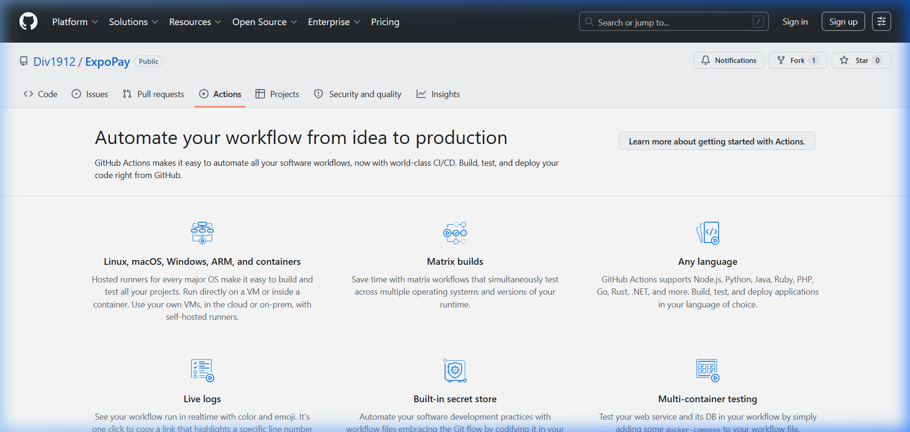

# EXPO - Global Payment Router

A cross-border payment platform built on the Stellar blockchain. EXPO enables instant, low-cost international payments with Universal IDs, smart escrow contracts, and seamless fiat to crypto conversion.


## 🔗 Live Demo
[https://expopay.vercel.app](https://expopay.vercel.app)

## 📱 Mobile Responsive View (375px)


## ⚙️ CI/CD Pipeline



## Overview

EXPO is a full-stack Web3 payment application that combines:
- **Universal Identity System** - Human-readable payment addresses (`username@expo`)
- **Instant P2P Transfers** - Send money globally in seconds via Stellar
- **Smart Escrow Contracts** - Soroban-based escrow for secure freelancer payments
- **Cross-Border Merchant Payments** - Pay Indian merchants with crypto (they receive INR via UPI)
- **Multi-Currency Support** - Automatic FX conversion between XLM, USDC, INR, USD, EUR, GBP

## Features

### Core Payment Features
- **Universal ID Resolution** - Send to `alice@expo` instead of complex wallet addresses
- **Real-time FX Quotes** - Live exchange rates with locked pricing windows
- **QR Code Payments** - Scan to pay with instant settlement
- **Transaction History** - Complete audit trail with Stellar Explorer links

### Escrow Smart Contracts

- **On-Chain Escrow** - Funds locked in Soroban smart contracts
- **Milestone-Based Release** - Freelancer marks delivered, client releases funds
- **Dispute Resolution** - Built-in dispute and refund mechanisms
- **Deadline Enforcement** - Auto-refund on expiry

### Merchant Payments (India)

- **UPI Integration** - Pay any Indian UPI QR code
- **Crypto-to-INR** - Your XLM/USDC converted to INR instantly
- **RBI LRS Compliant** - Follows Liberalised Remittance Scheme guidelines
- **Demo Merchants** - Test with simulated Indian merchants

### Security
- **4-Digit PIN Protection** - All transactions require PIN authorization
- **On-Chain Settlement** - All payments recorded on Stellar blockchain
- **Non-Custodial Design** - Users control their own keys


## App screnshots

Dashboard


*Pay with your Crypto on local shops in India*


*Transaction History*

*Verify Transaction on Stellar Explorer*


*Escrow -Create contract for your Work (between freelancer seller and buyer using Soroban Smart Contract*


### CI/CD Pipeline — GitHub Actions


## Tech Stack

### Frontend
- **Next.js 15** - React framework with App Router
- **TypeScript** - Type-safe development
- **Tailwind CSS 4** - Utility-first styling
- **Framer Motion** - Smooth animations
- **GSAP** - Advanced scroll animations
- **Radix UI** - Accessible component primitives
- **Lucide Icons** - Beautiful icon set

### Backend
- **Next.js API Routes** - Serverless functions
- **Supabase** - PostgreSQL database + Auth + Realtime
- **Stellar SDK** - Blockchain interactions for settling Merchant and P2P payments

### Blockchain
- **Stellar Network** - Fast, low-cost transactions (~$0.00001 per tx)
- **Soroban Smart Contracts** - Rust-based escrow logic for creating contract between deller and buyer
- **Horizon API** - Account management and queries

### Infrastructure
- **Supabase Auth** - Phone/email authentication
- **Supabase Realtime** - Live transaction updates
- **PostgreSQL** - User profiles, transaction history, contracts

## Project Structure

```
expo/
├── contracts/
│   └── escrow/
│       └── src/
│           └── lib.rs          # Soroban escrow smart contract
├── src/
│   ├── app/
│   │   ├── api/
│   │   │   ├── contracts/      # Escrow API routes
│   │   │   │   ├── route.ts    # Create contract
│   │   │   │   ├── deliver/    # Mark delivered
│   │   │   │   ├── release/    # Release funds
│   │   │   │   ├── dispute/    # Raise dispute
│   │   │   │   └── refund/     # Request refund
│   │   │   ├── expo/           # Core user APIs
│   │   │   │   ├── balance/    # Get wallet balance
│   │   │   │   ├── profile/    # User profile
│   │   │   │   ├── resolve/    # Resolve Universal ID
│   │   │   │   └── pin/        # PIN management
│   │   │   ├── payments/       # P2P payment APIs
│   │   │   │   ├── send/       # Send payment
│   │   │   │   └── history/    # Transaction history
│   │   │   ├── merchant/       # Merchant payment APIs
│   │   │   │   ├── pay/        # Process merchant payment
│   │   │   │   ├── quote/      # Get XLM->INR quote
│   │   │   │   └── history/    # Merchant payment history
│   │   │   └── fx/
│   │   │       └── quote/      # FX rate quotes
│   │   ├── auth/               # Authentication pages
│   │   │   ├── login/
│   │   │   ├── signup/
│   │   │   └── callback/
│   │   ├── dashboard/          # Main app pages
│   │   │   ├── page.tsx        # Dashboard overview
│   │   │   ├── send/           # Send money
│   │   │   ├── receive/        # Receive (show QR)
│   │   │   ├── scan/           # Scan QR to pay
│   │   │   ├── merchant/       # Pay UPI merchants
│   │   │   ├── contracts/      # Escrow contracts
│   │   │   ├── history/        # Transaction history
│   │   │   ├── profile/        # Wallet & security
│   │   │   └── settings/       # App settings
│   │   └── page.tsx            # Landing page
│   ├── components/
│   │   ├── sections/           # Landing page sections
│   │   │   ├── Hero.tsx
│   │   │   ├── QuickActions.tsx
│   │   │   ├── CardsSection.tsx
│   │   │   └── ...
│   │   └── ui/                 # Reusable UI components
│   ├── lib/
│   │   ├── stellar.ts          # Stellar SDK wrapper
│   │   ├── escrow.ts           # Soroban contract interactions
│   │   ├── supabase.ts         # Supabase clients
│   │   ├── supabase-server.ts  # Server-side auth
│   │   ├── fx-service.ts       # Exchange rate service
│   │   └── upi-service.ts      # UPI QR parsing
│   └── hooks/                  # Custom React hooks
└── public/                     # Static assets
```

## Smart Contract (Soroban)

The escrow contract (`contracts/escrow/src/lib.rs`) provides:

### Functions
| Function | Description | Inter-Contract Call |
|---|---|---|
| `create` | Create escrow with EXPO token_id | — |
| `fund` | Client locks EXPO tokens in escrow | ✅ Client → Escrow (EXPO token) |
| `deliver` | Freelancer marks work as delivered | — |
| `release_funds` | Client releases EXPO tokens to freelancer | ✅ Escrow → Freelancer (EXPO token) |
| `cancel_escrow` | Cancel and refund EXPO tokens to client | ✅ Escrow → Client (EXPO token) |
| `dispute` | Raise a dispute | — |
| `resolve` | Arbiter distributes EXPO tokens to winner | ✅ Escrow → Winner (EXPO token) |
| `get_escrow` | Query escrow state | — |
| `get_escrow_count` | Get total escrow count | — |

### Escrow States
```
Funded -> Delivered -> Released
   |
   v
Disputed -> Refunded
```

### Deployed Contracts (Stellar Testnet)
| Contract | Address |
|---|---|
| Escrow Contract | `CAGMD6PBDSOSB2NDOE5ZGYCWH74EOBJFHM627WTGLZZF66DBRUFWYSPT` |
| EXPO Token Contract | `CDLZFC3SYJYDZT7K67VZ75HPJVIEUVNIXF47ZG2FB2RMQQVU2HHGCN8` |

### 🔁 Inter-Contract Call Transaction
- **Tx Hash:** `d62faff341a803b549c7c244acb0e1fd502823ee4f9ce815c51cd9eebd473f76`
- **Explorer:** [View on Stellar Expert](https://stellar.expert/explorer/testnet/tx/d62faff341a803b549c7c244acb0e1fd502823ee4f9ce815c51cd9eebd473f76)

## API Routes

### Payments
| Endpoint | Method | Description |
|----------|--------|-------------|
| `/api/payments/send` | POST | Send P2P payment |
| `/api/payments/history` | GET | Get transaction history |

### Escrow Contracts
| Endpoint | Method | Description |
|----------|--------|-------------|
| `/api/contracts` | GET | List user's contracts |
| `/api/contracts` | POST | Create new contract |
| `/api/contracts/deliver` | POST | Mark as delivered |
| `/api/contracts/release` | POST | Release funds |
| `/api/contracts/dispute` | POST | Raise dispute |
| `/api/contracts/refund` | POST | Request refund |

### User
| Endpoint | Method | Description |
|----------|--------|-------------|
| `/api/expo/profile` | GET | Get user profile |
| `/api/expo/balance` | GET | Get wallet balances |
| `/api/expo/resolve` | GET | Resolve Universal ID |
| `/api/expo/pin` | POST | Set/update PIN |

### Merchant
| Endpoint | Method | Description |
|----------|--------|-------------|
| `/api/merchant/quote` | POST | Get INR conversion quote |
| `/api/merchant/pay` | POST | Process merchant payment |
| `/api/merchant/history` | GET | Merchant payment history |

## Environment Variables

Create a `.env` file with:

```env
# Supabase
NEXT_PUBLIC_SUPABASE_URL=your_supabase_url
NEXT_PUBLIC_SUPABASE_ANON_KEY=your_anon_key
SUPABASE_SERVICE_ROLE_KEY=your_service_key

# Stellar
SOROBAN_RPC_URL=https://soroban-testnet.stellar.org
STELLAR_NETWORK_PASSPHRASE=Test SDF Network ; September 2015
ESCROW_CONTRACT_ID=CAGMD6PBDSOSB2NDOE5ZGYCWH74EOBJFHM627WTGLZZF66DBRUFWYSPT
TOKEN_CONTRACT_ID=CDLZFC3SYJYDZT7K67VZ75HPJVIEUVNIXF47ZG2FB2RMQQVU2HHGCN8
NEXT_PUBLIC_ESCROW_CONTRACT_ID=CAGMD6PBDSOSB2NDOE5ZGYCWH74EOBJFHM627WTGLZZF66DBRUFWYSPT
NEXT_PUBLIC_TOKEN_CONTRACT_ID=CDLZFC3SYJYDZT7K67VZ75HPJVIEUVNIXF47ZG2FB2RMQQVU2HHGCN8
PLATFORM_SECRET_KEY=your_platform_wallet_secret

# App
NEXT_PUBLIC_APP_URL=http://localhost:3000
```

## Database Schema

### profiles
```sql
- id (uuid, PK)
- universal_id (text, unique)  -- e.g., "alice"
- stellar_address (text)       -- Public key
- stellar_secret (text)        -- Encrypted secret
- full_name (text)
- phone (text)
- preferred_currency (text)    -- XLM, USDC, INR, USD, EUR
- app_pin (text)              -- 4-digit PIN hash
- verified (boolean)
- created_at (timestamp)
```

### transactions
```sql
- id (uuid, PK)
- sender_id (uuid, FK)
- recipient_id (uuid, FK)
- sender_universal_id (text)
- recipient_universal_id (text)
- amount (decimal)
- currency (text)
- tx_hash (text)              -- Stellar transaction hash
- status (text)
- note (text)
- purpose (text)
- created_at (timestamp)
```

### contracts
```sql
- id (uuid, PK)
- escrow_id (integer)         -- On-chain escrow ID
- payer_id (uuid, FK)
- freelancer_id (uuid, FK)
- payer_universal_id (text)
- freelancer_universal_id (text)
- amount (decimal)
- currency (text)
- title (text)
- description (text)
- status (text)               -- funded, delivered, released, disputed, refunded
- expiry_timestamp (bigint)
- tx_hash_create (text)
- tx_hash_release (text)
- tx_hash_refund (text)
- created_at (timestamp)
```

### merchant_payments
```sql
- id (uuid, PK)
- user_id (uuid, FK)
- merchant_name (text)
- merchant_upi_id (text)
- inr_amount (decimal)
- xlm_amount (decimal)
- rate (decimal)
- tx_hash (text)
- status (text)
- created_at (timestamp)
```

## Getting Started

### Prerequisites
- Node.js 18+
- npm/yarn/pnpm/bun
- Supabase account
- Stellar testnet account (for testing)

### Installation

1. **Clone the repository**
```bash
git clone https://github.com/yourusername/expo.git
cd expo
```

2. **Install dependencies**
```bash
npm install
# or
bun install
```

3. **Set up environment variables**
```bash
cp .env.example .env
# Edit .env with your credentials
```

4. **Set up Supabase**
- Create a new Supabase project
- Run the database migrations (see schema above)
- Enable Realtime for `transactions` and `contracts` tables

5. **Run the development server**
```bash
npm run dev
```

6. **Open the app**
Navigate to [http://localhost:3000](http://localhost:3000)

### Building the Escrow Contract

```bash
cd contracts/escrow
cargo build --target wasm32-unknown-unknown --release
stellar contract deploy \
  --wasm target/wasm32-unknown-unknown/release/escrow.wasm \
  --source-account your_account \
  --network testnet
```

## Usage

### Creating an Account
1. Visit `/auth/signup`
2. Enter your phone number or email
3. Verify with OTP
4. Choose your Universal ID (e.g., `alice`)
5. A Stellar wallet is automatically created using Stellar SDK  and funded via friendbot

### Sending Money
1. Go to Dashboard > Send
2. Enter recipient's Universal ID (e.g., `bob@expo`)
3. Enter amount and select currency
4. Review the FX quote (if cross-currency)
5. Enter your 4-digit PIN
6. Transaction settles in ~3 seconds

### Creating an Escrow Contract
1. Go to Dashboard > Contracts
2. Click "Create Contract"
3. Enter freelancer's Universal ID
4. Set amount and deadline
5. Funds are locked on-chain
6. Freelancer marks delivered when complete
7. You release funds to freelancer

### Paying Indian Merchants
1. Go to Dashboard > Pay Merchant
2. Scan UPI QR or select demo merchant
3. Enter INR amount
4. Review XLM conversion rate
5. Confirm with PIN
6. Merchant receives INR via UPI

## Security Considerations

- **Private Keys**: Stored encrypted in Supabase. Consider moving to hardware security modules (HSM) for production.
- **PIN Storage**: Currently plaintext. Should be hashed with bcrypt for production.
- **Rate Limiting**: Implement rate limiting on all API routes.
- **HTTPS**: Always use HTTPS in production.
- **Audit**: Smart contracts should be audited before mainnet deployment.

## Roadmap

- [ ] Mainnet deployment
- [ ] Hardware wallet integration (Ledger, Trezor)
- [ ] Multi-signature escrow
- [ ] Recurring payments
- [ ] Invoice generation
- [ ] Mobile apps (iOS, Android)
- [ ] More fiat on/off ramps
- [ ] DEX integration for swaps

## Contributing

Contributions are welcome! Please read our contributing guidelines and submit PRs.


## Links

- [Stellar Documentation](https://developers.stellar.org/)
- [Soroban Smart Contracts](https://soroban.stellar.org/)
- [Supabase Documentation](https://supabase.com/docs)
- [Next.js Documentation](https://nextjs.org/docs)

---

Built with love on the Stellar Network
