<div align="center">

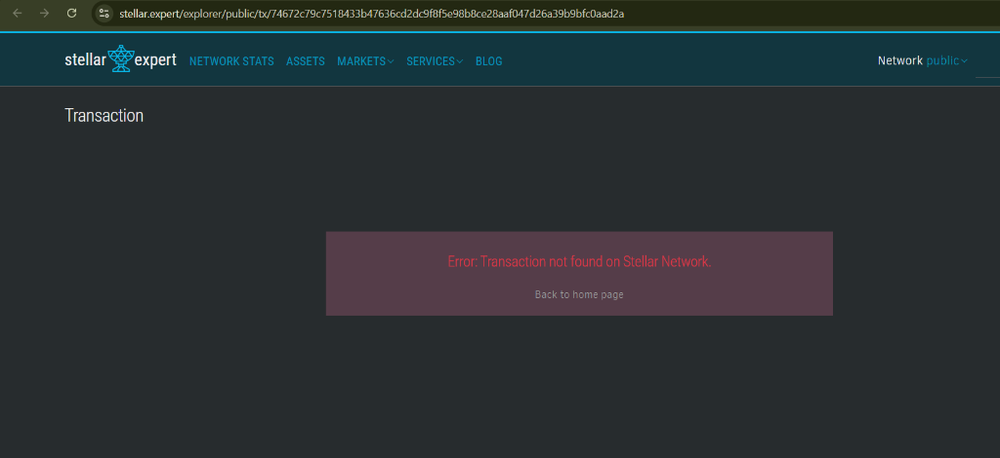

# Zpay — Agentic Global Payment Router

**Cross-border payments, escrow, group bills, and on chain savings — all on Stellar.**

Zpay turns wallet addresses into human-readable Universal IDs (`alice@Zp`), settles payments in seconds via Stellar, lets Indian merchants receive INR via UPI, lets freelancers and clients lock funds in Soroban escrow, and adds vault savings with yield on XLM.

[**Live demo ➔**](https://zpayrouter.me) &nbsp;•&nbsp; [](https://github.com/Div1912/Z-Pay/actions) &nbsp;•&nbsp; [](https://zpayrouter.me) &nbsp;•&nbsp; [](https://x.com/Zpayroute)

[](https://x.com/Zpayroute/status/2081314236840722464?s=20) &nbsp;•&nbsp; [](https://docs.google.com/spreadsheets/d/e/2PACX-1vRNaTRN9f4wrlpapTOg6w6kU9aNmMLFfZiwKg08naaq2TXrvhXLWVUJ5Uy8VBiHAvk1bwT6tgvIfe_2/pubhtml?gid=105799872&single=true)

</div>

## Table of Contents

1. [Highlights](#highlights)
2. [Feature tour with screenshots](#feature-tour)
3. [Architecture](#architecture)
4. [Smart contracts](#smart-contracts-soroban)
5. [API reference](#api-reference)
6. [Getting started](#getting-started)
7. [Project structure](#project-structure)
8. [Security notes](#security-notes)
9. [Roadmap](#roadmap)
10. [Release notes](#release-notes)

---

## Highlights

- **ZUB (ZPay Unified Balance)** — True cross-chain DeFi. Deposit USDC via MetaMask on Base, Polygon, or Arbitrum and instantly spend it globally on the Stellar network with zero bridging friction.
- **Universal IDs** — send to `div@Zp` instead of a 56-char Stellar public key.
- **X402 Protocol** — Agents can interact with your wallet , Can pay for upu , Can earn for you.
- **Indian UPI bridge** — pay any UPI QR with crypto; merchant receives INR.
- **Instant P2P** — XLM/USDC/INR P2P transfers settled on Stellar in ~3 seconds.
- **Escrow with arbiter** — Soroban contract handles fund/deliver/release/dispute/resolve. Two-step arbiter override pays the freelancer even when the on-chain `release` is locked.
- **Split bills** — equal or custom-share bill splitting across `@Zp` users, with per-participant payment tracking and notifications.
- **On-chain Vault** — fixed-term ZPAY staking (30/60/90 days, up to 6%) plus a no-lock XLM yield pool that mints ZPAY rewards daily. Live accrual UI, compound projection, and a real-time earnings ticker.
- **Cross-currency FX** — XLM ↔ USDC ↔ INR/USD/EUR/GBP with locked-window quotes.
- **Inactivity guard, transaction PINs, on-chain audit trail** — every action emits a Stellar tx hash you can verify on Stellar Expert.

---

## Feature tour

### Landing page


### 1 · Dashboard overview

The home of the app — wallet balance, recent transactions, quick actions for Send/Scan/Split/Vault.

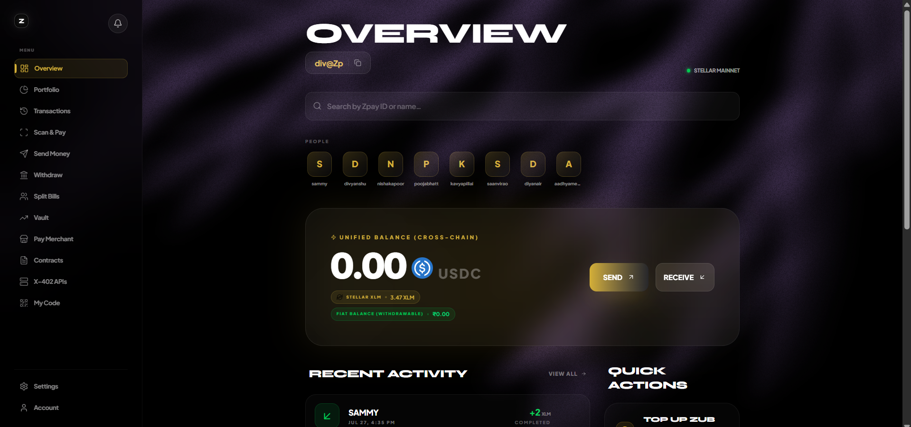

### 2 · Pay Indian merchants with crypto

Scan any UPI QR or pick a demo merchant. The platform converts XLM/USDC to INR at a locked rate and settles UPI to the merchant.


### 3 · P2P send

Send to `bob@Zp` instead of `GAB6F…`. Cross-currency sends show a live FX quote with a locked window.

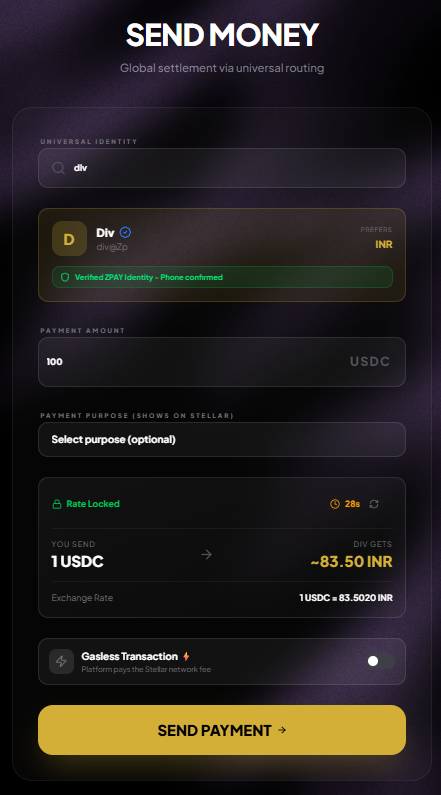

### 4 · Transaction history

Every payment, escrow action, split contribution, and vault event in one place — each row links to Stellar Expert for on-chain verification.


### 5 · Soroban escrow contracts

Lock funds in a Soroban contract, mark delivered, release on completion. If something goes wrong, either party can dispute and an arbiter resolves it on-chain.

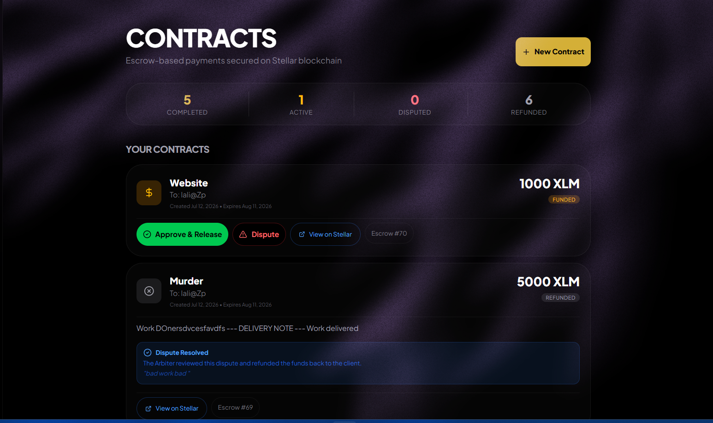

**ARBITER CONSOLE** - For solving Dispute between two contracted Parties.


### 6 · Autonomous AI Agents (X-402 Protocol)

Z-Pay implements the cutting-edge **X-402 Protocol**, allowing autonomous AI agents (like Claude or GPT) to natively hold balances, parse smart invoices, and autonomously execute payments on the Stellar network. 

**Model Context Protocol (MCP) Server Integration:** 
We have built a dedicated MCP server that connects directly to the Z-Pay backend. Agents can use the MCP server to query balances, resolve Universal IDs (`alice@Zp`), and securely send payments on behalf of users or as independent entities via code!

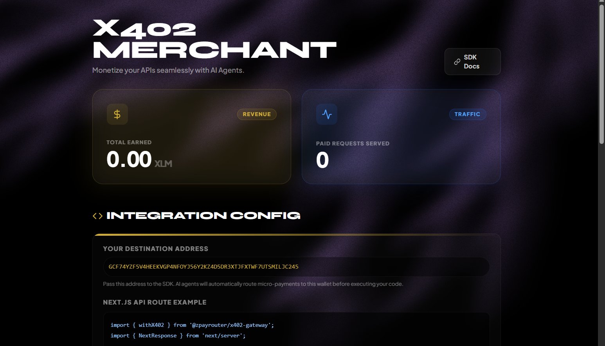
<br/>
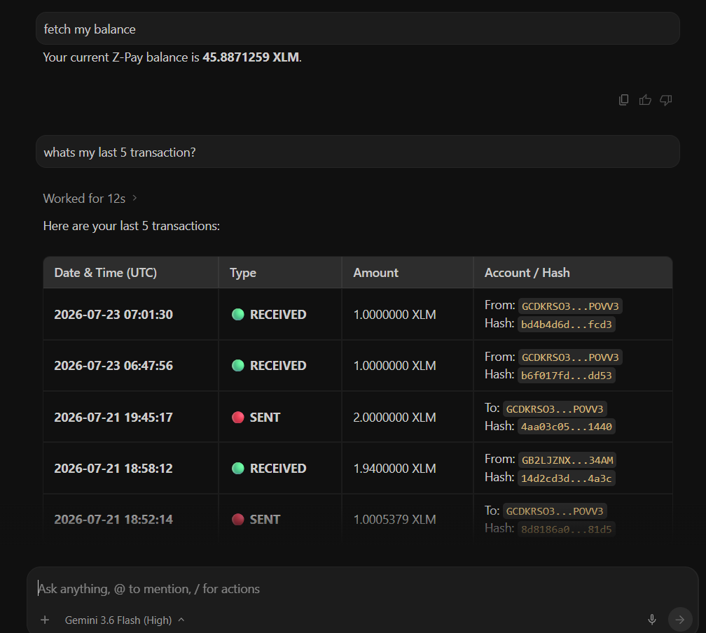

### 7 · Split bills *(new)*

Create a bill, pick `@Zp` participants, choose **Equal** or **Custom shares**, and the app tracks who's paid and who hasn't. Each participant pays from their own balance with a single tap; the split updates in real time for everyone.

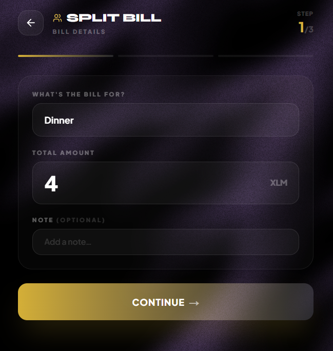

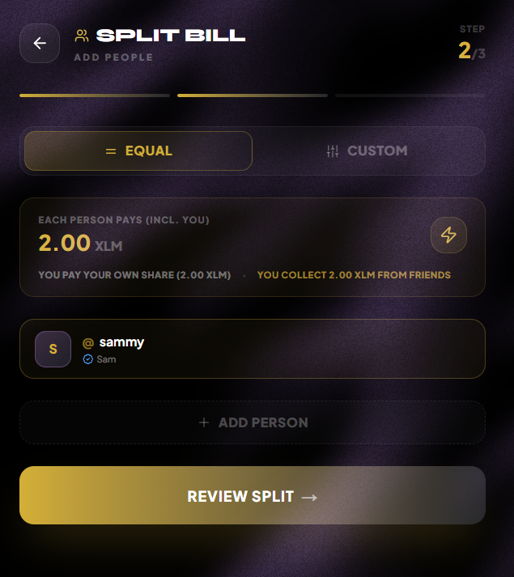

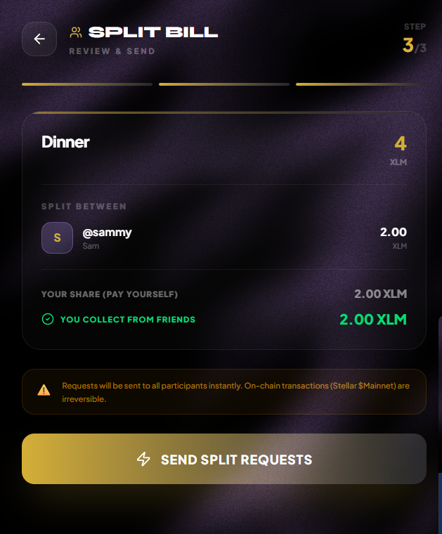

What's under the hood:

- `split_bills` + `split_participants` tables track totals and per-user shares
- Each pay-in is an on-chain Stellar payment from participant → creator
- Status transitions: `active` → `partial` → `paid` (auto when all participants settle)

### 8 · Vault — staking + yield pool *(new)*

Two products in one tab. Live earnings ticker, animated stake progress, and a built-in compound-interest projection.

#### Staking

Lock ZPAY for 30, 60, or 90 days for **1.25% / 3.00% / 6.00%** flat reward (≈15 / 18 / 24% APR). Each active stake card shows current value, time remaining, accrued reward (animated 1 Hz), and a one-tap claim when the lock expires.

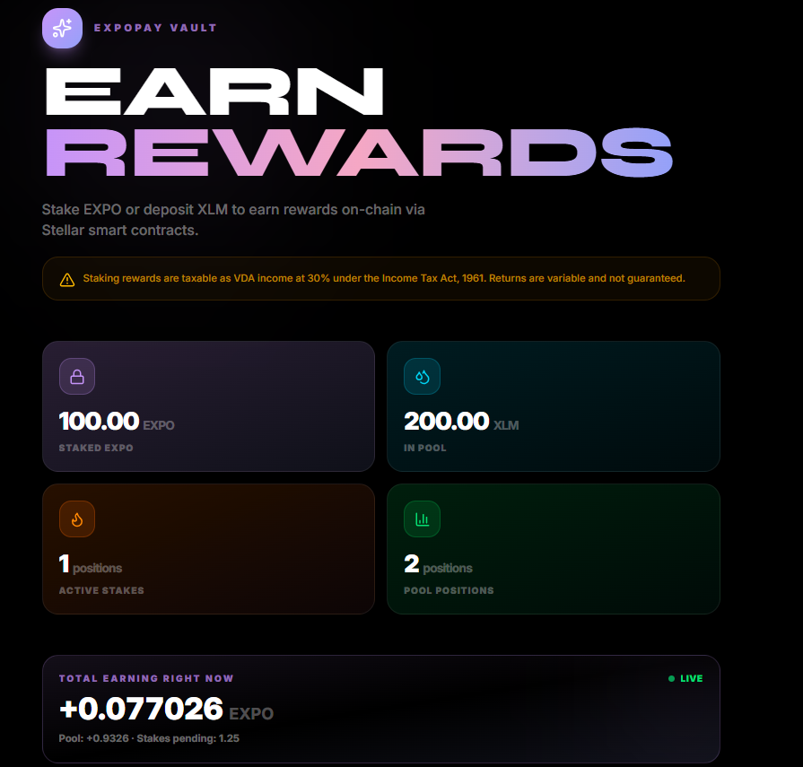

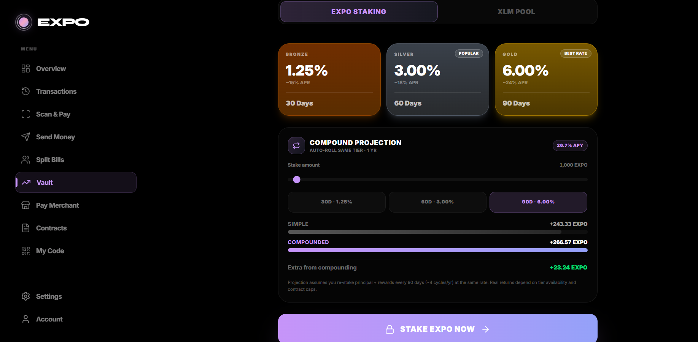

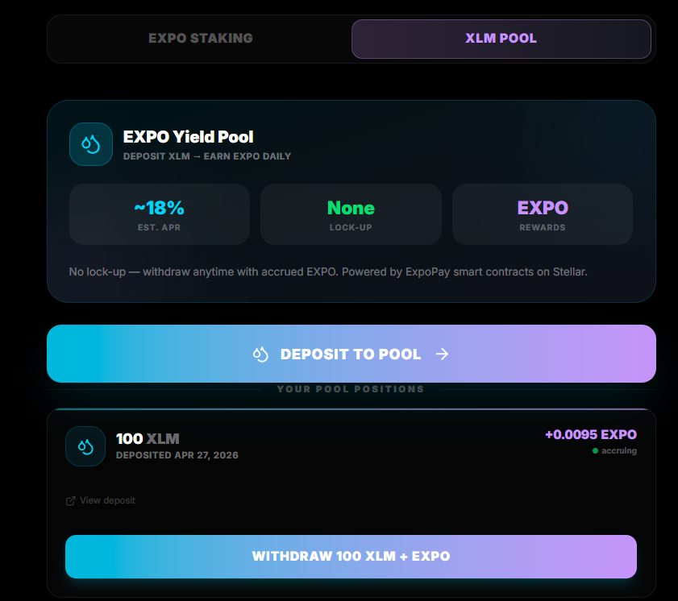

#### Compound projection (innovation)

Drag the slider for amount, tap a tier — see what auto-rolling that tier yields vs simple interest over a year, with the true APY computed via discrete compounding `P × (1+r)^n − P`.

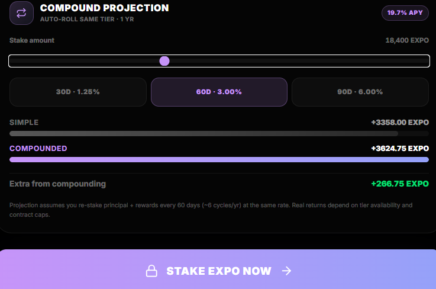

#### XLM Yield Pool

Deposit XLM with **no lock-up**, earn ZPAY at 0.5% per XLM per day (~18% APR). Withdraw anytime; rewards accrue linearly and are paid out in ZPAY from the pool's reward bucket on withdrawal.

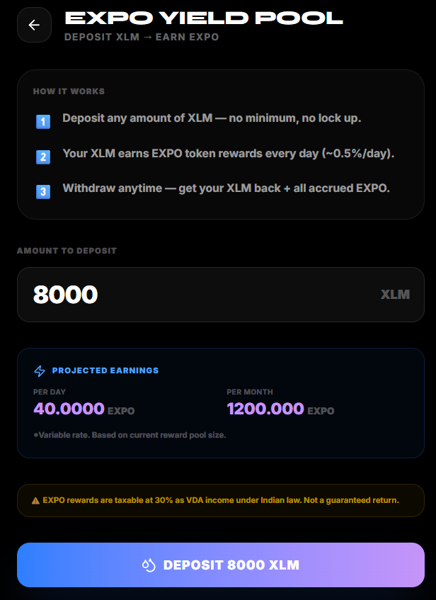

### 9 · ZUB (ZPay Unified Balance) *(new)*

Abstracting blockchain fragmentation. Connect your MetaMask and deposit USDC from EVM networks (Base, Polygon, Arbitrum).
ZPay's backend cryptographically verifies the transaction via raw RPC logs and credits your Unified Ledger. 
Spend your cross-chain wealth instantly at any ZPay merchant on the Stellar network. No bridging delays, no gas fees at checkout.

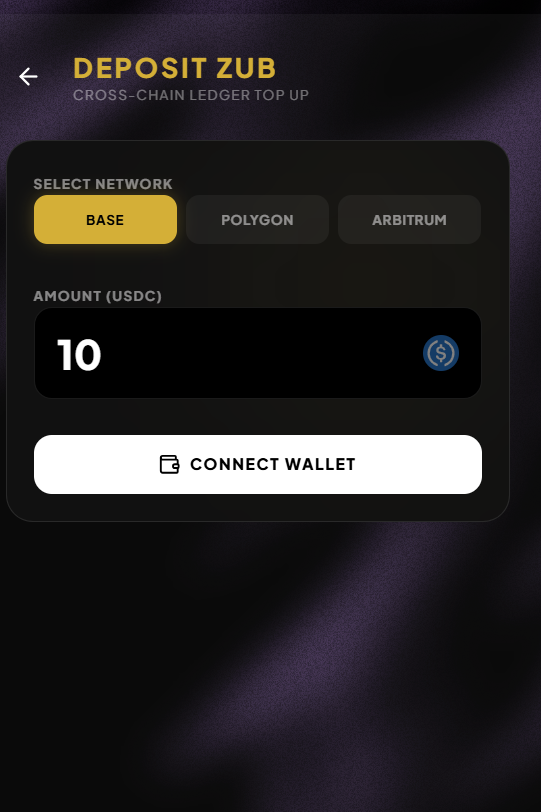

### 10 · CI / CD

Every push runs the `ci.yml` workflow: typecheck, lint, build, contract test suite. Plus, automated Vercel deployments.

[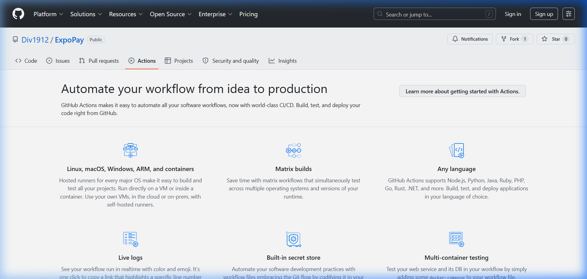](https://github.com/Div1912/Z-Pay/actions)

### Advanced Feature: Fee Sponsorship (Gasless Transactions)

Zpay implements **Stellar fee_bump_transaction** so the platform sponsors XLM network fees, enabling users to send payments with **0 XLM fee**.

**Implementation:** [`src/lib/fee-bump.ts`](./src/lib/fee-bump.ts) · [`src/app/api/payments/gasless/route.ts`](./src/app/api/payments/gasless/route.ts)

**How it works:**
1. User's inner transaction (signed with their key) is built server-side
2. Platform wraps it in `fee_bump_transaction` (signed with `PLATFORM_SECRET_KEY`)
3. On-chain `fee_source` = platform wallet; user pays **zero XLM in fees**
4. Send page shows a **Gasless ⚡** toggle; confirmation shows *"Fee sponsored by Zpay"*

**Proof:** 

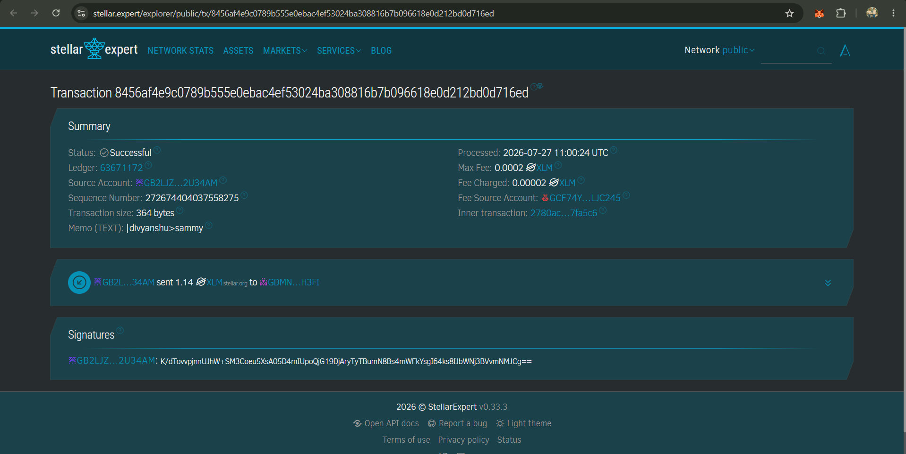


### **Metrics Dashboard**

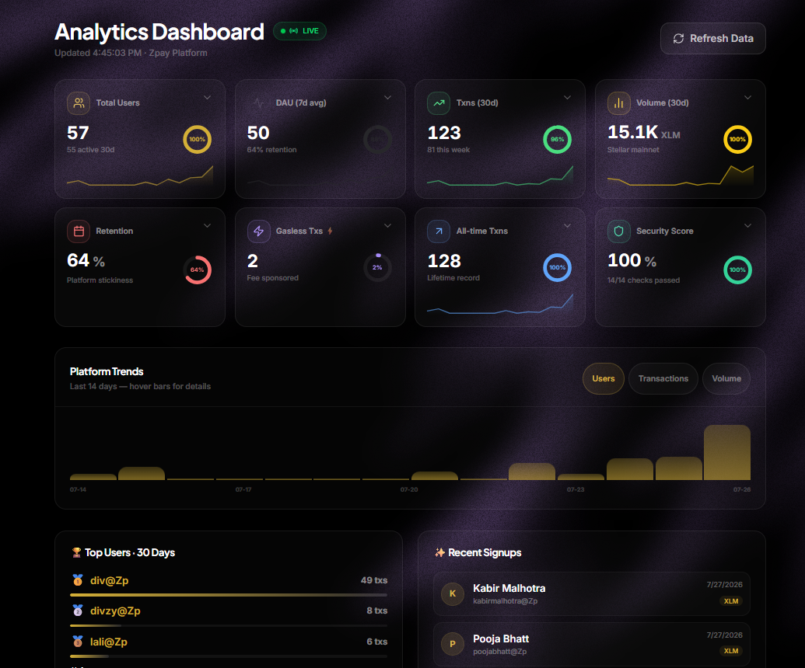

**Live dashboard  showing**:
- **DAU** (daily active users — last 14 days bar chart)
- **Retention rate** (week-over-week cohort analysis)
- **Transaction volume** (30-day daily bar chart)
- **Top users** by activity (30d)
- **Gasless transaction count**


### Production Monitoring


**Real time log stream  showing** :
- Structured event log from all API routes (level: info/warn/error)
- Live errors and warnings grouped by severity
- Network/DB latency and 500 response spikes

### 11 📈 Community Growth

We are actively building our community of developers and early adopters!

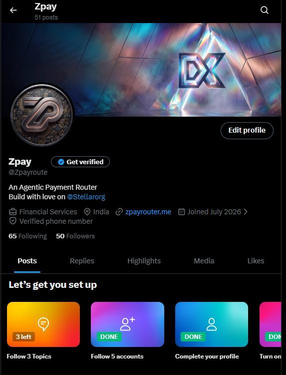

---
### Security Checklist

See [SECURITY.md](./SECURITY.md) for the complete checklist. Current score: **~62% implemented** with remaining items on the mainnet hardening backlog.

Key items: server-side auth on every route ✅, 4-digit PIN ✅, inactivity guard ✅, on-chain audit trail ✅, structured logging ✅, fee-bump privacy ✅.

### Data Indexing

**Migration file:** [`supabase_blackbelt_migration.sql`](./supabase_blackbelt_migration.sql)

Indexes added:
- `idx_transactions_sender_created` — fast per-user history
- `idx_transactions_recipient_created` — fast recipient lookup
- `idx_transactions_created_date` — date-bucket metrics queries
- `idx_contracts_payer_created` / `idx_contracts_freelancer_status`
- `idx_app_logs_level`, `idx_app_logs_created_at`

**Endpoint:** `GET /api/admin/metrics` — aggregated analytics from all indexed tables

### Community Contribution

[X](https://x.com/raaz_divyanshu/status/2049812470660039009?s=20)


### User Onboarding Improvement Plan

Based on user feedback collected via [Google Form](https://docs.google.com/spreadsheets/d/e/2PACX-1vR82azl8byhjpi6hAnn8naPIsU5H-I_TGDyDFqdP2jv7xJXpp5O1MSdHBfHmFYH0v7Bka2FSSyrEbS2/pubhtml?gid=224759150&single=true):

1. **Simplified onboarding** — Removed "Activate Wallet" confusion and cleaned up UI.
2. **Global Fiat Gateway** — Upgraded Onramp integration to support 100+ global fiat currencies.
3. **Role-Based Access** — Hidden Admin panels from regular users to prevent confusion.
4. **Mainnet Security** — Secret Keys moved to secure Account settings with warnings.

###  User Wallet Addresses

*(list of 30+ verified Stellar testnet wallet addresses)*

[**View User Onboarding Responses →**](https://docs.google.com/spreadsheets/d/e/2PACX-1vR82azl8byhjpi6hAnn8naPIsU5H-I_TGDyDFqdP2jv7xJXpp5O1MSdHBfHmFYH0v7Bka2FSSyrEbS2/pubhtml?gid=224759150&single=true)

---

---

## Architecture


```mermaid
graph TD
    %% Styling
    classDef frontend fill:#1e1e1e,stroke:#C694F9,stroke-width:2px,color:#fff,border-radius:8px;
    classDef backend fill:#1e1e1e,stroke:#94A1F9,stroke-width:2px,color:#fff,border-radius:8px;
    classDef db fill:#1e1e1e,stroke:#4ade80,stroke-width:2px,color:#fff,border-radius:8px;
    classDef blockchain fill:#1e1e1e,stroke:#facc15,stroke-width:2px,color:#fff,border-radius:8px;
    classDef external fill:#1e1e1e,stroke:#f87171,stroke-width:2px,color:#fff,border-radius:8px;

    %% Components
    subgraph Client ["Client Side (Next.js 15 App Router)"]
        UI["React UI + Tailwind 4<br/>(Framer Motion, GSAP)"]
    end

    subgraph Server ["Server Side (Next.js API Routes)"]
        AuthAPI["Auth & Profile API"]
        PaymentAPI["P2P & Split Bill API"]
        ContractAPI["Escrow API"]
        SavingsAPI["Staking & Vault API"]
        MerchantAPI["Merchant UPI API"]
    end

    subgraph Infrastructure ["Supabase Platform"]
        AuthDB["Supabase Auth"]
        PG["PostgreSQL Database<br/>(Profiles, Txs, Contracts)"]
        Realtime["Realtime WebSockets"]
    end

    subgraph Stellar ["Stellar Blockchain (Mainnet)"]
        Horizon["Horizon RPC<br/>(Ledger & Balances)"]
        Soroban["Soroban Smart Contracts<br/>(Escrow, Pool, Staking)"]
        Asset["Stellar Assets<br/>(XLM, ZPAY, USDC)"]
    end

    subgraph EVM ["EVM Chains (Base, Polygon)"]
        RPC["Raw RPC Nodes<br/>(Cryptographic Tx Verification)"]
        MetaMask["MetaMask / Web3 Wallet"]
    end

    subgraph External ["External Services"]
        Email["Resend API<br/>(Transactional Emails)"]
        FX["FX Rates API"]
        UPI["UPI Resolution"]
    end

    %% Client Interactions
    UI <-->|REST/JSON| Server
    UI <-->|Live Updates| Realtime
    UI <-->|Web3 Tx| MetaMask

    %% Server Interactions with DB
    AuthAPI <--> AuthDB
    PaymentAPI <--> PG
    ContractAPI <--> PG
    SavingsAPI <--> PG
    MerchantAPI <--> PG

    %% Server Interactions with Blockchain
    PaymentAPI <-->|Transaction Builder| Horizon
    MerchantAPI <-->|Cross-border TX| Horizon
    ContractAPI <-->|Invoke| Soroban
    SavingsAPI <-->|Invoke| Soroban
    Server <-->|ZUB Verification| RPC

    %% External
    Server -->|Email Alerts| Email
    MerchantAPI -->|Live Conversion| FX
    MerchantAPI -->|Resolve VPA| UPI

    %% Internal Blockchain
    Horizon <--> Asset
    Soroban <--> Asset
    MetaMask --> RPC

    %% Apply Styles
    class UI frontend;
    class AuthAPI,PaymentAPI,ContractAPI,SavingsAPI,MerchantAPI backend;
    class AuthDB,PG,Realtime db;
    class Horizon,Soroban,Asset,RPC,MetaMask blockchain;
    class Email,FX,UPI external;
```

---

## Smart contracts (Soroban)

Three contracts are deployed and used in production:

### Escrow — `contracts/escrow/src/lib.rs`

| Function | Description | Inter-contract call |
|---|---|---|
| `create` | Create an escrow with ZPAY `token_id` | — |
| `fund` | Client locks ZPAY tokens in escrow | ✅ Client → Escrow |
| `deliver` | Freelancer marks work as delivered | — |
| `release` | Client releases ZPAY to freelancer | ✅ Escrow → Freelancer |
| `refund` | Cancel and refund ZPAY to client | ✅ Escrow → Client |
| `dispute` | Either party raises a dispute | — |
| `resolve` | Arbiter distributes ZPAY to winner *(superseded — see note below)* | ✅ Escrow → Winner |
| `get` | Query escrow state | — |

**Arbiter resolution note.** The current testnet build is a pre-`resolve` revision. Arbiter outcomes are handled in the API by:
- *Refund client* → `refund(escrow_id)` signed by the payer.
- *Pay freelancer* → `refund(escrow_id)` then a SEP-41 `transfer` from the payer's wallet to the freelancer's, both signed custodially. Net result equals a single resolve-to-freelancer call.

### Staking — `contracts/staking/src/lib.rs`

| Function | Description |
|---|---|
| `init` | Set the ZPAY token address and admin (one-time) |
| `stake` | Lock ZPAY for 30/60/90 days, returns `stake_id` |
| `unstake` | Burn the stake position, payout = principal + reward |
| `get_stake` | Query a single stake by id |
| `get_pool_balance` | View remaining reward pool |
| `fund_pool` | Admin tops up the reward pool |

Reward math: linear, flat-rate `reward = amount × bps / 10000` over the lock duration. Stake states: `active → claimed`. Reward bps by tier: 30d → 125, 60d → 300, 90d → 600.

### XLM Yield Pool — `contracts/pool/src/lib.rs`

| Function | Description |
|---|---|
| `init` | Set ZPAY reward token + admin |
| `deposit` | Lock XLM, returns `position_id` |
| `withdraw` | Return principal + ZPAY accrued |
| `get_position` | Query a deposit |
| `fund_rewards` | Admin tops up the ZPAY reward bucket |

Reward math: linear time-based accrual `accrued_expo = xlm_amount × BASE_REWARD_BPS_PER_DAY × elapsed_days / 10000` with `BASE_REWARD_BPS_PER_DAY = 50` (≈18% APR).

### Deployed contract IDs (Stellar Mainnet)

| Contract | Address |
|---|---|
| Escrow | `CDQBFXZXYW5ZEXDFB2HR7M3HBDYFF6WY46SHPTQBHHC6JMIOKTAOTYX2` |
| Native XLM Token (SAC) | `CAS3J7GYLGXMF6TDJBBYYSE3HQ6BBSMLNUQ34T6TZMYMW2EVH34XOWMA` |
| Staking & Pool | Set via `STAKING_CONTRACT_ID` / `POOL_CONTRACT_ID` env vars |

### Inter-contract call proof


- **Tx Hash:** `1bb09bca074eda29cb93938323c1033ea87459d683c59a05f8ce066083226faa`
- **Explorer:** [View on Stellar Expert](https://stellar.expert/explorer/public/tx/1bb09bca074eda29cb93938323c1033ea87459d683c59a05f8ce066083226faa)
- **Type:** `invoke_host_function` (escrow `fund` calling XLM SAC `transfer`)

---


---


---

## Environment variables

Create `.env` from `.env.example`:

```env
# Supabase
NEXT_PUBLIC_SUPABASE_URL=...
NEXT_PUBLIC_SUPABASE_ANON_KEY=...
SUPABASE_SERVICE_ROLE_KEY=...           # server-only — REQUIRED in production

# Stellar Mainnet
SOROBAN_RPC_URL=https://mainnet.sorobanrpc.com
STELLAR_NETWORK_PASSPHRASE=Public Global Stellar Network ; September 2015
PLATFORM_SECRET_KEY=...                 # platform wallet for merchant settlement

# Soroban contract IDs (Mainnet)
ESCROW_CONTRACT_ID=CDQBFXZXYW5ZEXDFB2HR7M3HBDYFF6WY46SHPTQBHHC6JMIOKTAOTYX2
TOKEN_CONTRACT_ID=CDLZFC3SYJYDZT7K67VZ75HPJVIEUVNIXF47ZG2FB2RMQQVU2HHGCYSC
STAKING_CONTRACT_ID=...                 # set after deploying contracts/staking
POOL_CONTRACT_ID=...                    # set after deploying contracts/pool

# Public mirrors (used in the browser)
NEXT_PUBLIC_ESCROW_CONTRACT_ID=CDQBFXZXYW5ZEXDFB2HR7M3HBDYFF6WY46SHPTQBHHC6JMIOKTAOTYX2
NEXT_PUBLIC_TOKEN_CONTRACT_ID=CDLZFC3SYJYDZT7K67VZ75HPJVIEUVNIXF47ZG2FB2RMQQVU2HHGCYSC

# Email (optional, for notifications)
RESEND_API_KEY=...
NOTIFY_FROM_EMAIL="Zpay <noreply@yourdomain>"

# App
NEXT_PUBLIC_APP_URL=http://localhost:3000
```

> ⚠️ The server now refuses to start in `production` if `SUPABASE_SERVICE_ROLE_KEY` is missing — a deliberate guardrail so admin writes can't silently fall back to anon.

---

## Getting started

### Prerequisites
- Node.js 18+
- bun, npm, or pnpm
- Supabase project
- Stellar Mainnet account (requires 1 XLM reserve)
- Rust + `stellar-cli` *(only if you want to redeploy contracts)*

### Setup

```bash
# 1. Clone & install
git clone https://github.com/Div1912/Z-Pay.git
cd Zpay
bun install        # or: npm install

# 2. Configure env
cp .env.example .env
$EDITOR .env

# 3. Create the database schema
#    Apply, in order, in the Supabase SQL editor:
#      supabase_migration.sql
#      supabase_split_migration.sql
#      supabase_savings_migration.sql
#    Then enable Realtime on `transactions`, `contracts`, `split_bills`,
#    `staking_positions`, `pool_positions`.

# 4. Run dev server
bun run dev        # or: npm run dev
# → http://localhost:3000
```

### Building & deploying contracts (optional)

```bash
# Each contract directory has its own Cargo.toml
cd contracts/escrow
cargo build --target wasm32-unknown-unknown --release

stellar contract deploy \
  --wasm target/wasm32-unknown-unknown/release/escrow.wasm \
  --source-account YOUR_ACCOUNT \
  --network public
# → returns the contract ID; paste into ESCROW_CONTRACT_ID

# repeat for contracts/staking and contracts/pool, then call init() once
```

There's also `scripts/deploy.ts` for batch deployment and `scripts/fund-rewards.ts` for topping up the staking and pool reward buckets.

---

## Project structure

```
Zpay/
├── contracts/
│   ├── escrow/      # Soroban escrow contract
│   ├── staking/     # Fixed-term ZPAY staking
│   └── pool/        # XLM deposit pool with ZPAY rewards
├── scripts/
│   ├── deploy.ts        # Bulk-deploy all contracts
│   └── fund-rewards.ts  # Top up reward pools
├── src/
│   ├── app/
│   │   ├── api/
│   │   │   ├── admin/{contracts,resolve}/   # Arbiter actions
│   │   │   ├── contracts/{deliver,dispute,fund,refund,release}/
│   │   │   ├── zpay/{balance,check,check-phone,claim,pin,profile,resolve}/
│   │   │   ├── fx/quote/
│   │   │   ├── merchant/{history,pay,quote}/
│   │   │   ├── payments/{history,send}/
│   │   │   ├── savings/{positions,stake,unstake,pool/{deposit,withdraw}}/
│   │   │   └── split/[id]/pay/
│   │   ├── auth/                     # Login, signup, OTP, reset
│   │   ├── dashboard/
│   │   │   ├── admin/                # Arbiter console
│   │   │   ├── contracts/            # Escrow UI
│   │   │   ├── history/              # Tx history
│   │   │   ├── merchant/             # Pay UPI
│   │   │   ├── savings/              # Vault: staking + pool
│   │   │   ├── scan/                 # QR scanner
│   │   │   ├── send/                 # Send P2P
│   │   │   ├── split/                # Split bills
│   │   │   ├── receive/              # Show your QR
│   │   │   ├── profile/  settings/
│   │   │   └── page.tsx              # Overview
│   │   ├── onboarding/
│   │   └── page.tsx                  # Landing
│   ├── components/
│   │   ├── InactivityGuard.tsx       # Auto-logout w/ visibility-aware timers
│   │   ├── Background.tsx  Logo.tsx  Navbar.tsx
│   │   ├── PaymentNotification.tsx   # Realtime in-app alerts
│   │   ├── sections/                 # Landing-page blocks
│   │   └── ui/                       # Reusable primitives (Radix-based)
│   ├── lib/
│   │   ├── stellar.ts                # Stellar SDK wrapper
│   │   ├── escrow.ts                 # Escrow + token transfer helpers
│   │   ├── savings.ts                # Staking & pool client
│   │   ├── fx-service.ts             # Live FX quotes
│   │   ├── upi-service.ts            # UPI QR parsing
│   │   ├── notify.ts                 # Resend email helpers
│   │   ├── supabase.ts               # Browser + admin clients
│   │   └── supabase-server.ts        # Server-side getUser()
│   └── middleware.ts                 # Auth gate for /dashboard/* and /auth/*
├── supabase_migration.sql
├── supabase_split_migration.sql      # NEW
├── supabase_savings_migration.sql    # NEW
└── screenshots/                      # README assets
```

---

## Security notes

What's already in place:
- Server-side `getUser()` on every API route; middleware also redirects unauthenticated browser navigations.
- 4-digit transaction PIN required for sends, merchant payments, escrow refunds.
- Inactivity guard with 15-min timeout, visibility-aware so it doesn't fire while the phone is backgrounded.
- Service-role Supabase client refuses to start in production if `SUPABASE_SERVICE_ROLE_KEY` is missing.
- All money-moving operations emit a Stellar transaction hash; nothing is "off-chain only".

What's still on the hardening backlog (call out in any prod deploy):
- **Encrypt `stellar_secret` at rest.** Currently plaintext in Postgres.
- **Hash `app_pin`** with bcrypt + add lockout after N failed attempts.
- **Rate-limit** auth, OTP, refund, admin-resolve endpoints.
- **Promote admin/arbiter** out of the hardcoded `ADMIN_EMAILS` list into a `profiles.role` column.
- **Smart-contract audit** before mainnet; current state is testnet-only.

---

## Roadmap

- [x] Universal IDs + P2P sends
- [x] Soroban escrow (create/fund/deliver/release/dispute/refund)
- [x] Indian UPI merchant bridge
- [x] Split bills with on-chain settlement
- [x] ZPAY staking + XLM yield pool
- [x] ZUB (ZPay Unified Balance) cross-chain infrastructure
- [x] Compound projection UI
- [ ] Auto-compound opt-in (on-chain auto-restake)
- [ ] Stake streaks (consecutive completions → reward multiplier)
- [ ] Anti-rugpull insurance vault
- [x] Mainnet deployment + smart-contract audit
- [ ] Hardware-wallet signing (Ledger / Trezor)
- [ ] Multi-signature escrow
- [ ] Native iOS / Android apps

---

## Release notes

All notable changes, version history, and published binaries are tracked on the **GitHub Releases** page:

👉 **[View all releases →](https://github.com/Div1912/Z-Pay/releases)**

You can also subscribe to new releases via GitHub's **Watch → Custom → Releases** option on the repository page to get notified whenever a new version ships.

---

## Useful Links

- [Platform Dashboard](https://zpayrouter.me/dashboard)
- [Monthly Growth & Traction Report (July 2026)](./monthly_growth_report.md)

---

## Links

- [Stellar Documentation](https://developers.stellar.org/)
- [Soroban Smart Contracts](https://soroban.stellar.org/)
- [Supabase Docs](https://supabase.com/docs)
- [Next.js Docs](https://nextjs.org/docs)
- [Release notes](https://github.com/Div1912/Z-Pay/releases)

---

<div align="center">

Built on the Stellar Network · MIT License

</div>


